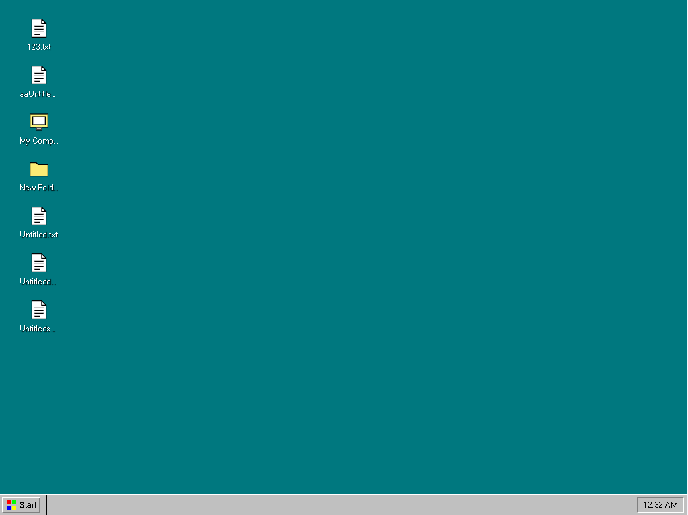

# Win95-HK

<div align="center">
  
  <h3>A nostalgic Windows 95 experience with Hong Kong influences</h3>
</div>

## 🖥️ About

Win95-HK is a web application that reimagines the classic Windows 95 operating system with influences from Hong Kong's unique style and culture. This project is a personal tribute to my first PC experience - a Windows 95 computer my dad bought and taught me to use as a child.

The application combines the nostalgic elements of Windows 95's interface with neon colors, Traditional Chinese typography, and visual elements inspired by Hong Kong's unique urban landscape.

## ✨ Features

- **Authentic Win95 Experience**: Classic Windows 95 UI elements like the Start Menu, taskbar, and window controls
- **Hong Kong Influences**: Traditional Chinese typography and visual elements inspired by Hong Kong's unique urban landscape
- **Modern Web Technologies**: Built with Next.js v15, TypeScript, and Tailwind CSS
- **State Management**: Efficient state handling with Zustand for window management and application state
- **Responsive Design**: Maintains the Win95 look and feel across different device sizes

## 🚀 Tech Stack

- **Framework**: Next.js v15 with App Router
- **Language**: TypeScript
- **Styling**: Tailwind CSS with custom Win95 configuration
- **State Management**: Zustand
- **UI Components**: Custom Win95-style components

## 📷 Screenshots

<div align="center">
  
</div>

## 🔧 Getting Started

### Prerequisites

- Node.js 18.x or higher
- pnpm

### Installation

1. Clone the repository

   ```bash
   git clone https://github.com/kelvin6365/Win95-HK.git
   cd Win95-HK
   ```

2. Install dependencies

   ```bash
   pnpm install
   ```

3. Run the development server

   ```bash
   pnpm dev
   ```

4. Open [http://localhost:3000](http://localhost:3000) in your browser

## 📁 Project Structure

```
Win95-HK/
├── app/                # Next.js App Router directory
├── components/         # Shared components
│   └── ui/             # General UI components & Windows 95 style components
├── lib/                # Utility functions and helpers
│   ├── utils/          # Utils
│   └── store           # Zustand
└── public/             # Static assets
```

## 🎮 Usage

- Click the Start button to open the Start Menu
- Drag windows by their title bars to move them
- Resize windows by dragging their borders
- Explore various applications in the Windows 95 environment

## 🤝 Contributing

Contributions are welcome! Feel free to open issues or submit pull requests.

1. Fork the repository
2. Create your feature branch (`git checkout -b feature/amazing-feature`)
3. Commit your changes (`git commit -m 'Add some amazing feature'`)
4. Push to the branch (`git push origin feature/amazing-feature`)
5. Open a Pull Request

## 📝 License

This project is licensed under the MIT License - see the [LICENSE](LICENSE) file for details.

## 🙏 Acknowledgements

- Inspired by the classic Windows 95 operating system
- Hong Kong's cyberpunk aesthetic and urban landscape
- All contributors and supporters of this project

---

<div align="center">
  Made with ❤️ and nostalgia by <a href="https://github.com/kelvin6365">Kelvin</a>
</div>
